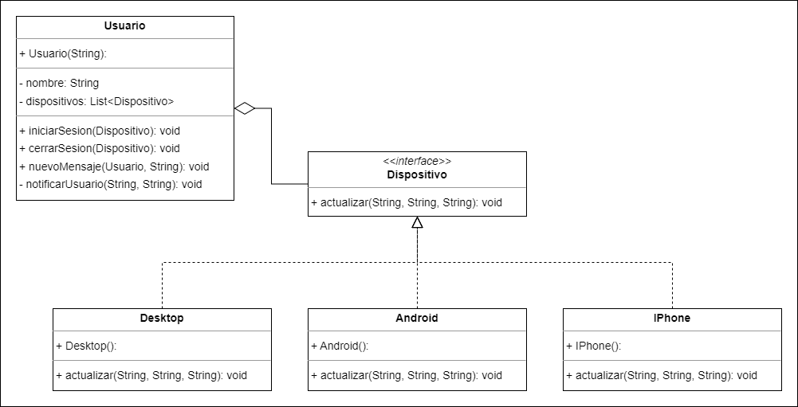

# ArquiSoftware-Patrones

## Problema 1
### Patrón: Prototype
Siguiendo la solución propuesta por el patrón Prototype, se creó una clase abstracta HeroePrototype en la que se
definieron las propiedades y comportamientos que todo héroe del videojuego debería tener independientemente de la clase
escogida por el jugador, como es el caso de atacar y defender, o modificar el nombre o aspecto (color) del personaje.
Adicionalmente, se creó una clase auxiliar ExperienciaCalculator para delegar la responsabilidad del cálculo de nivel y
puntos según la cantidad de experiencia que tenga el personaje.

Heredando de la clase anterior, aparecen las subclases Guerrero, Arquero y Mago, en las que se definen las habilidades
base de cada grupo y se sobreescribe el método clonar() para que al momento de clonar, el personaje corresponda al mismo
grupo del modelo que copia (el método clonar de un Mago debería únicamente crear un objeto Mago, y no un Guerrero).

Por último, en la clase Main se agregan los métodos jugar() y printInfo() para poder ver de forma clara el
funcionamiento de este  patrón.

## Problema 2
### Patrón: Observer

Utilizando el patrón Observer, se implementó una solución con una clase Usuario que sirve como la clase Publisher del
patrón, en ella está contendia una lista de dispositivos (Subscribers) con objetos de tipo Dispositivo. El usuario puede
agregar un dispositivo en su lista iniciando sesión en él con el método iniciarSesión() especificando un objeto
Dispositivo y a su vez eliminarlo cerrando sesión con cerrarSesion(). El usuario también tiene la posibilidad de enviar
un mensaje a otro usuario con el método nuevoMensaje(), que como parámetros recibe el destinatario (Usuario) y el
mensaje (String).

En cuanto a los dispositivos, la interfaz Dispositivo contiene el método actualizar(), implementado por las subclases
hijas para generar una notificación en el dispositivo. Como subclases de Dispositivo, se crearon las clases IPhone,
Android y Desktop, cada una con una forma distinta de notificar al usuario.

Al momento de recibir un mensaje, se acciona el método notificarUsuario() del destinatario, el cuál recorre su lista de
dispositivos llamando el método actualizar() en cada uno de los dispositivos, enviándole el mensaje y su remitente,
generando la notificación en cada dispositivo.

## Problema 3
### Patrón:

## Problema 4
### Patrón: Command
Siguiendo la solución propuesta por el patrón Command, se creó una interfaz Command que define los métodos execute() y
undo(). Estos métodos representan las acciones que se pueden realizar sobre las tareas en el sistema de gestión de 
tareas, como crear, eliminar, o modificar tareas.
Heredando de la interfaz Command, se implementaron las clases concretas CreateTaskCommand y DeleteTaskCommand. Cada una 
de estas clases encapsula una acción específica que se puede realizar sobre una tarea.

Adicionalmente, se creó una clase auxiliar llamada TaskManager que se encarga de gestionar las tareas del sistema. Esta
clase incluye métodos para agregar, eliminar y obtener tareas, dejando la responsabilidad de la gestión de las tareas 
en un solo lugar.

Para coordinar la ejecución de los comandos, se implementó la clase CommandExecutor. Esta clase es responsable de 
ejecutar los comandos y mantener un registro de ellos para permitir deshacer la última acción realizada. Esto 
proporciona una manera ordenada de ejecutar y revertir acciones dentro del sistema.

Por último, en la clase Main se crea un nuevo TaskManager y un nuevo CommandExecutor para despues poner a crear una 
nueva tarea. Después llamar el crear un nuevo comando, y retroceder el ultimo comando

## Problema 5
### Patrón: Decorator
En esta solución, se creó una clase abstracta Habitacion que define las propiedades que toda habitación del hotel 
debería tener independientemente de las personalizaciones hechas por el cliente. Entre estos se incluye la descripción y
el costo base de la habitación, así como la capacidad de personalizar la decoración debido a mejoras adicionales.

Adicionalmente, se creó una clase auxiliar CostoAdicionalCalculator que tiene la responsabilidad del cálculo del costo 
total dependiendo de las mejoras adicionales que se aplican a la habitación.

Por último, en la clase Hotel se agrega una nueva habitacion basica, y se le agregan distintos complementos para 
comprobar el funcionamiento del codigo

## Integrantes
- Valentina Rodríguez
- Santiago Carrillo
- Felipe Ballesteros