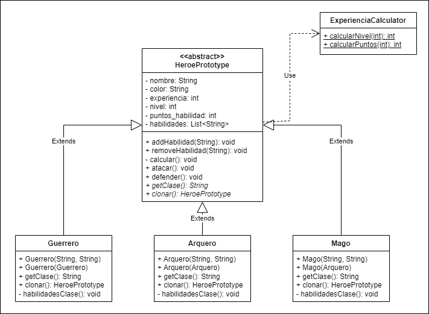

# ArquiSoftware-Patrones

## Problema 1
### Patrón: Prototype
Siguiendo la solución propuesta por el patrón Prototype, se creó una clase abstracta HeroePrototype en la que se
definieron las propiedades y comportamientos que todo héroe del videojuego debería tener independientemente de la clase
escogida por el jugador, como es el caso de atacar y defender, o modificar el nombre o aspecto (color) del personaje.
Adicionalmente, se creó una clase auxiliar ExperienciaCalculator para delegar la responsabilidad del cálculo de nivel y
puntos según la cantidad de experiencia que tenga el personaje.

Heredando de la clase anterior, aparecen las subclases Guerrero, Arquero y Mago, en las que se definen las habilidades
base de cada grupo y se sobreescribe el método clonar() para que al momento de clonar, el personaje corresponda al mismo
grupo del modelo que copia (el método clonar de un Mago debería únicamente crear un objeto Mago, y no un Guerrero).

Por último, en la clase Main se agregan los métodos jugar() y printInfo() para poder ver de forma clara el
funcionamiento de este  patrón.

## Problema 2
### Patrón:

## Problema 3
### Patrón:

## Problema 4
### Patrón:

## Problema 5
### Patrón:

## Integrantes
- Valentina Rodríguez
- Santiago Carrillo
- Felipe Ballesteros